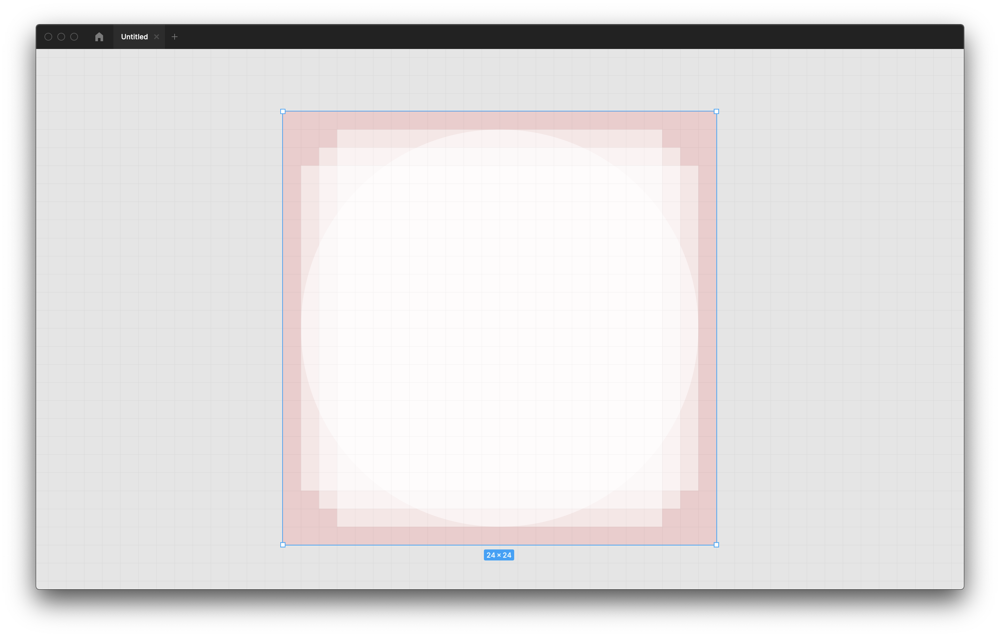

# amadora-arte-urbana

## References

- [Arte Urbana](https://dados.gov.pt/pt/datasets/arte-urbana-1/) dataset by Câmara Municipal da Amadora. Special thanks to [Fernando Ferreira](https://dados.gov.pt/pt/users/fernando-ferreira/) for responding to my comments and updating the dataset!
- [Quotation mark](https://en.wikipedia.org/wiki/Quotation_mark#Summary_table) Wikipedia page.
- [Os graffiti = os grafíti = os grafitos](https://ciberduvidas.iscte-iul.pt/consultorio/perguntas/os-graffiti/11701) in Ciberdúvidas da Língua Portuguesa.
- [Graffiti](http://www.portaldalinguaportuguesa.org/index.php?action=lemma&lemma=125140) in Portal da Língua Portuguesa.
- [Amadora City brand](https://www.behance.net/gallery/25301943/Amadora-City-brand) by GBNT agency.
- [CMA logo](https://www.amadorabd.com/assets/images/footer/amadora.svg).
- [Kruella D'Enfer's website](http://www.kruelladenfer.com/Water-the-conductor-of-Life).
- [A datação das décadas e dos séculos](https://ciberduvidas.iscte-iul.pt/consultorio/perguntas/a-datacao-das-decadas-e-dos-seculos/11883) in Ciberdúvidas da Língua Portuguesa.
- [Trompe-l'œil](https://en.wikipedia.org/wiki/Trompe-l%27%C5%93il) Wikipedia page.
- [Share variables between JavaScript and CSS](https://www.falldowngoboone.com/blog/share-variables-between-javascript-and-css/) blog post by Ryan Boone.

## Development

- Install [pnpm](https://pnpm.io/installation) (if necessary).
- `pnpm install`.
- `pnpm dev`.

## Notes

- [Non Boring Gradients](https://non-boring-gradients.netlify.app/).
- `pnpm install -D eslint prettier eslint-config-prettier eslint-plugin-prettier eslint-plugin-react eslint-plugin-react-hooks eslint-plugin-jsx-a11y eslint-plugin-import @joaopalmeiro/prettier-config @joaopalmeiro/eslint-config-react`
- [thefuzz](https://github.com/seatgeek/thefuzz) Python package.
- [diff_strings.py](https://gist.github.com/ines/04b47597eb9d011ade5e77a068389521) by Ines Montani.
- [Escola Profissional Gustave Eiffel](https://gustaveeiffel.pt/) (EPGE).
- [2 º não é a mesma coisa que 2.º](https://ciberduvidas.iscte-iul.pt/artigos/rubricas/pelourinho/2--nao-e-a-mesma-coisa-que-2/263) in Ciberdúvidas da Língua Portuguesa. [abreviatura de número e de numerais ordinais [Ortografia]](https://www.flip.pt/Duvidas-Linguisticas/Duvida-Linguistica/DID/1612). [abreviatura de numeral ordinal [Ortografia]](https://www.flip.pt/Duvidas-Linguisticas/Duvida-Linguistica/DID/3916).
- [FLiP On-line](https://www.flip.pt/FLiP-On-line/Corrector-ortografico-e-sintactico).
- [PDM](https://pdm.fming.dev/) (Python package manager).
- [29.º Amadora BD](https://www.cm-amadora.pt/eventos.html?view=event&itid=726).
- trompe-l'œil or trompe l'oeil.
- Spectrum and React Spectrum:
  - `pnpm install @adobe/react-spectrum`.
  - Breakpoints are named following T-shirt sizing. They are mobile first.
  - [Available style props](https://react-spectrum.adobe.com/react-spectrum/styling.html#style-props). [Sizes](https://react-spectrum.adobe.com/react-spectrum/styling.html#dimension-values).
  - The `<View />` component is like a `
`, ``, or `<Box />` component (depending on the `elementType` prop).
  - `UNSAFE_className` and `UNSAFE_style` props.
  - [Color for data visualization](https://spectrum.adobe.com/page/color-for-data-visualization/).
- `pnpm install @theme-ui/presets`.
- [react-cookie](https://github.com/reactivestack/cookies/tree/master/packages/react-cookie) package.
- [Auto-Sizing Columns in CSS Grid: `auto-fill` vs `auto-fit`](https://css-tricks.com/auto-sizing-columns-css-grid-auto-fill-vs-auto-fit/) blog post by Sara Soueidan:
  - "`auto-fill` FILLS the row with as many columns as it can fit."
  - "`auto-fit` FITS the CURRENTLY AVAILABLE columns into the [available] space (...)"
- [Recoil](https://recoiljs.org/):
  - `pnpm install recoil`.
  - **Atoms** are units of state to which **components** can subscribe.
  - **Selectors** are used to compute derived data based on state.
  - Atoms need a unique `key`.
  - `useRecoilState()` for atoms and `useRecoilValue()` for atoms and selectors.
- `pnpm eslint --print-config .eslintrc`.
- [View and edit local storage](https://developer.chrome.com/docs/devtools/storage/localstorage/) (Chrome).
- [`location.reload()`](https://developer.mozilla.org/en-US/docs/Web/API/Location/reload).
- [Nucleo Icon Guidelines — Introduction](https://blog.nucleoapp.com/nucleo-icon-guidelines-introduction-70092f8b4697):
  - [Nucleo](https://nucleoapp.com/) (icon management app).
  - The grid used to design the icons adds constraints that force us to match the optical volume of the icons.
  - 24px × 24px grid.
  - Matching the optical volume means having a similar ratio between the space occupied by the icon and the space available across the various icons.
  - To handle optical volume in narrow icons, rotate them by 45 degrees.
- [Making a Rotating Icon Button in React](https://www.steveruiz.me/posts/rotating-icon-button):
  - Microinteractions.
  - [react-feather](https://github.com/feathericons/react-feather) icons. [Design guidelines](https://github.com/feathericons/feather/issues/171#issuecomment-455356985).

